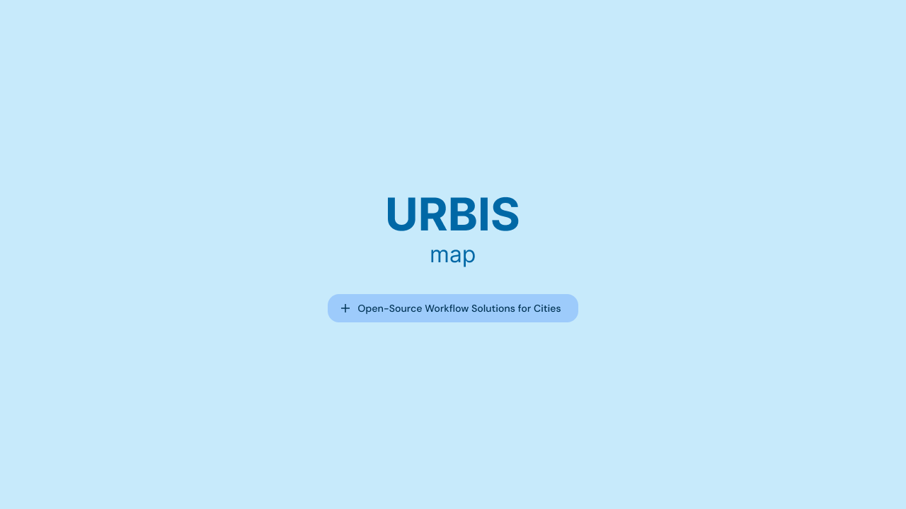

# Urbis Map



[](https://github.com/OpenUrbis/urbis-map/actions/workflows/lint-and-test.yaml)
[](https://github.com/OpenUrbis/urbis-map/actions/workflows/build-and-deploy.yaml)
[](https://www.gnu.org/licenses/agpl-3.0)
[](https://github.com/OpenUrbis/urbis-map/releases)
[](https://github.com/OpenUrbis/urbis-map/blob/main/docs/CONTRIBUTING.md)
[](https://github.com/OpenUrbis/urbis-map/pulls)

Urbis Map is an open-source platform designed to support city governments in mapping and managing public resources, services, and infrastructure. It provides flexible, modular tools to enhance transparency, optimize decision-making, and improve municipal governance.

This is a community-maintained project. If you encounter an issue, please submit a pull request with a fix. GitHub Issues will be closed.

---

## Overview

Urbis Map is an open-source monorepo created to empower municipal administrations with a robust mapping system for public management. It enables cities to visualize and manage urban data, streamline resource allocation, and foster data-driven governance.

- **Website**: [urbis.sampa.br](http://urbis.sampa.br/)
- **GitHub Repository**: [github.com/OpenUrbis/urbis-map](https://github.com/OpenUrbis/urbis-map)

---

## Installation

To get started with Urbis Map, install the dependencies using your preferred package manager:

```bash
npm install
# or
yarn install
# or
pnpm install
```

---

## Usage

To start the development server:

```bash
# start postgres
yarn composer:up
npm run dev
```

This will launch the local development environment, allowing you to test and explore the mapping system.

For production builds:

```bash
npm run build
```

---

## Documentation

Explore the documentation to learn how to set up, use, and extend Urbis Map:

- [Full Documentation](http://docs.urbis.sampa.br/)
- [Contributing Guide](docs/CONTRIBUTING.md)
- [Commit Guidelines](docs/commit-guidelines.md)
- [Pull Request Guidelines](docs/pull-request-guidelines.md)
- [Deploy Guidelines](docs/DEPLOY.md)

---

## Local Development

To contribute to Urbis Map, follow these steps:

1. **Clone the repository**:

   ```bash
   git clone https://github.com/OpenUrbis/urbis-map.git
   ```

2. **Install dependencies**:

   ```bash
   yarn install
   ```

3. **Start the development server**:

   ```bash
   yarn dev
   ```

4. Open your browser and visit `http://localhost:5173`.

---

## Contribution

We welcome community contributions! Read our [Contributing Guidelines](CONTRIBUTING.md) to learn how to submit pull requests, report issues, or suggest improvements.

- Found a bug? Submit a pull request with a fix.
- Want to add a feature? Open a pull request with your proposal.

---

## License

Urbis Map is licensed under the [AGPL v3](https://www.gnu.org/licenses/agpl-3.0). You are free to use, modify, and distribute this software under the terms of the AGPL v3, ensuring that any derivative works remain open source.

---

## Community

We’re building a community around Urbis Map! Join the conversation and help us improve the project:

Stay tuned for updates on our official channels (coming soon). For now, feel free to reach out via [contas@urbis.sampa.br](mailto:contas@urbis.sampa.br) or open a discussion in the repository.

---

## Contributors

A huge thanks to all our contributors! Your efforts make Urbis Map better for everyone.

<!-- ALL-CONTRIBUTORS-LIST:START - Do not remove or modify this section -->
<!-- prettier-ignore-start -->
<!-- markdownlint-disable -->
<table>
   <tbody>
      <tr>
         <td align="center" valign="top" width="14.28%"><a href="https://github.com/h-pgy"><br /><sub><b>Henrique Pougy</b></sub></a><br /><a href="https://github.com/OpenUrbis/urbis-map/commits?author=h-pgy" title="Documentation">📖</a> <a href="#maintenance-h-pgy" title="Maintenance">🚧</a></td>
         <td align="center" valign="top" width="14.28%"><a href="https://github.com/mauryascm"><br /><sub><b>mauryascm</b></sub></a><br /><a href="https://github.com/OpenUrbis/urbis-map/commits?author=mauryascm" title="Documentation">📖</a> <a href="#maintenance-mauryascm" title="Maintenance">🚧</a> <a href="https://github.com/OpenUrbis/urbis-map/commits?author=mauryascm" title="Tests">⚠️</a> <a href="#projectManagement-mauryascm" title="Project Management">📆</a></td>
         <td align="center" valign="top" width="14.28%"><a href="https://github.com/RenanTashiro"><br /><sub><b>Renan Tashiro</b></sub></a><br /><a href="https://github.com/OpenUrbis/urbis-map/commits?author=RenanTashiro" title="Code">💻</a> <a href="#projectManagement-RenanTashiro" title="Project Management">📆</a> <a href="https://github.com/OpenUrbis/urbis-map/commits?author=RenanTashiro" title="Documentation">📖</a> <a href="#maintenance-RenanTashiro" title="Maintenance">🚧</a></td>
         <td align="center" valign="top" width="14.28%"><a href="https://github.com/FernandoDorstSilva"><br /><sub><b>Fernando Dorst</b></sub></a><br /><a href="https://github.com/OpenUrbis/urbis-map/commits?author=FernandoDorstSilva" title="Code">💻</a> <a href="https://github.com/OpenUrbis/urbis-map/commits?author=FernandoDorstSilva" title="Documentation">📖</a></td>
         <td align="center" valign="top" width="14.28%"><a href="https://github.com/douglasgc"><br /><sub><b>Douglas Gabriel Cardoso</b></sub></a><br /><a href="https://github.com/OpenUrbis/urbis-map/commits?author=douglasgc" title="Code">💻</a> <a href="https://github.com/OpenUrbis/urbis-map/commits?author=douglasgc" title="Documentation">📖</a> <a href="#maintenance-douglasgc" title="Maintenance">🚧</a></td>
         <td align="center" valign="top" width="14.28%"><a href="https://github.com/laysmorimoto"><br /><sub><b>laysmorimoto</b></sub></a><br /><a href="https://github.com/OpenUrbis/urbis-map/commits?author=laysmorimoto" title="Documentation">📖</a></td>
         <td align="center" valign="top" width="14.28%"><a href="https://github.com/junior-anzolin"><br /><sub><b>Junior Anzolin</b></sub></a><br /><a href="https://github.com/OpenUrbis/urbis-map/commits?author=junior-anzolin" title="Code">💻</a> <a href="https://github.com/OpenUrbis/urbis-map/commits?author=junior-anzolin" title="Documentation">📖</a> <a href="#maintenance-douglasgc" title="Maintenance">🚧</a></td>
      </tr>
   </tbody>
</table>

<!-- markdownlint-restore -->
<!-- prettier-ignore-end -->

<!-- ALL-CONTRIBUTORS-LIST:END -->

---

## Star History

[](https://star-history.com/#OpenUrbis/urbis-map&Date)

---

## Contact

For questions, feedback, or support, reach out to us at [contas@urbis.sampa.br](mailto:contas@urbis.sampa.br).
