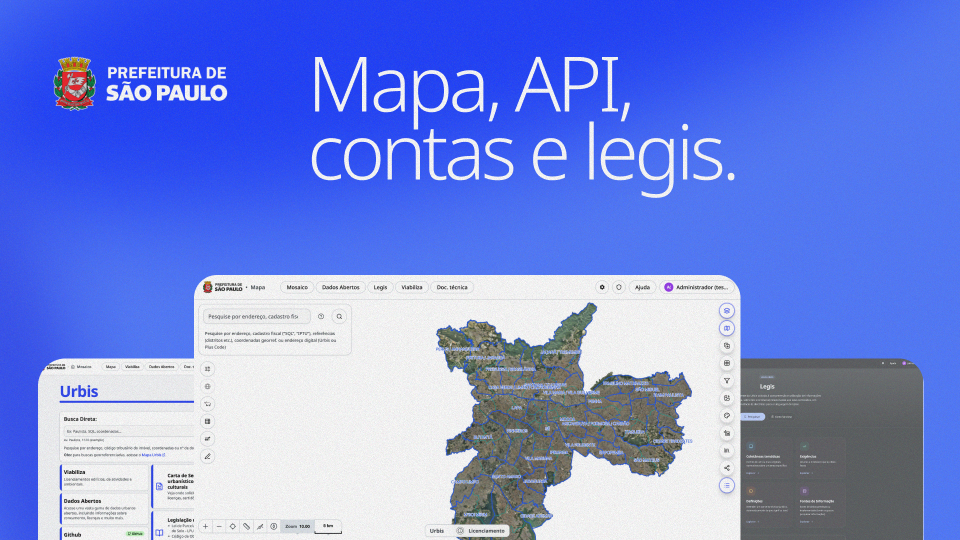

# Urbis


[](https://github.com/OpenUrbis/urbis/actions/workflows/lint-and-test.yaml)
[](https://github.com/trufflesecurity/trufflehog)
[](LICENSE.md)
[](https://github.com/OpenUrbis/urbis/releases)
[](https://github.com/OpenUrbis/urbis/stargazers)
[](https://github.com/OpenUrbis/urbis/network/members)
[](CONTRIBUTING.md)
[](https://github.com/OpenUrbis/urbis/pulls)
[](https://github.com/OpenUrbis/urbis/issues)

**Urbis** is an open-source territorial and municipal management platform designed to empower city governments with high-performance geospatial mapping (GIS), urban data management, legislation tracking, and citizen service workflows.

*O **Urbis** é uma plataforma de código aberto para gestão pública municipal e mapeamento territorial (GIS), permitindo a visualização de dados urbanos, gestão legislativa e processos administrativos voltados à transparência e tomada de decisão orientada a dados.*

- 🌐 **Portal Público (Mosaico)**: [urbis.prefeitura.sp.gov.br](https://urbis.prefeitura.sp.gov.br/)
- 🗺️ **Mapa Urbis (Web GIS)**: [mapa.urbis.prefeitura.sp.gov.br](https://mapa.urbis.prefeitura.sp.gov.br/)
- ⚖️ **Legis (Legislação e Normas Urbanísticas)**: [legis.urbis.prefeitura.sp.gov.br](https://legis.urbis.prefeitura.sp.gov.br/)
- 👤 **Contas / Accounts (Portal de Identidade & SSO)**: [conta.urbis.prefeitura.sp.gov.br](https://conta.urbis.prefeitura.sp.gov.br/)
- 📝 **Viabiliza (Workflows & Formulários Inteligentes)**: [viabiliza.urbis.prefeitura.sp.gov.br](https://viabiliza.urbis.prefeitura.sp.gov.br/)
- 📊 **Dados Abertos (Catálogo de Dados CKAN)**: [dadosabertos.urbis.prefeitura.sp.gov.br](https://dadosabertos.urbis.prefeitura.sp.gov.br/)
- 📖 **Documentação Técnica Completa**: [`apps/docs`](apps/docs) | [docs.urbis.prefeitura.sp.gov.br](https://docs.urbis.prefeitura.sp.gov.br)
- 🛠️ **Guia de Instalação & Setup**: [`apps/docs/content/docs/general/development/setup.mdx`](apps/docs/content/docs/general/development/setup.mdx) | [Online](https://docs.urbis.prefeitura.sp.gov.br/docs/general/development/setup)
- 🏛️ **Arquitetura & Módulos**: [`apps/docs/content/docs/general/architecture/index.mdx`](apps/docs/content/docs/general/architecture/index.mdx) | [Online](https://docs.urbis.prefeitura.sp.gov.br/docs/general/architecture)

---

## 🌐 Ecossistema de Repositórios (OpenUrbis no GitHub)

O **Urbis** é composto por repositórios modulares e desacoplados sob a organização [**OpenUrbis**](https://github.com/OpenUrbis):

| Repositório | Stack / Tecnologias | Descrição & Finalidade |
| :--- | :--- | :--- |
| [**`OpenUrbis/urbis-agent`**](https://github.com/OpenUrbis/urbis-agent) | Markdown, Bash, Python, MCPs | Central de inteligência, guia mestre de arquitetura, mapeamento de clusters Azure AKS e orquestração de submódulos. |
| [**`OpenUrbis/urbis`**](https://github.com/OpenUrbis/urbis) | Next.js, React 18, Angular, NestJS, Deck.gl, Tailwind | Monorepo Turborepo com o portal Mosaico, Web GIS (Mapa Urbis), Legis, Contas, Docs e API Gateway. |
| [**`OpenUrbis/urbis-datalake`**](https://github.com/OpenUrbis/urbis-datalake) | Python 3.11+, Dagster, PostGIS, GeoPandas, GeoServer | Datalake geoespacial com pipelines de ingestão, higienização e catálogo de dados em arquitetura medalhão. |
| [**`OpenUrbis/urbis-ckan`**](https://github.com/OpenUrbis/urbis-ckan) | Python, CKAN 2.10, PostgreSQL, Solr, Docker | Portal de Dados Abertos e catálogo de metadados territoriais do Município de São Paulo. |
| [**`OpenUrbis/urbis-workflows`**](https://github.com/OpenUrbis/urbis-workflows) | React, Next.js, Radix UI, Tailwind | Frontend do **Viabiliza**: formulários inteligentes, caixas de entrada de processos e interface administrativa. |
| [**`OpenUrbis/urbis-workflows-api`**](https://github.com/OpenUrbis/urbis-workflows-api) | NestJS, TypeScript, PostgreSQL, TypeORM | Backend e API Gateway do **Viabiliza**: validações de regras urbanísticas, integração com o SEI e motor de processos. |
| [**`OpenUrbis/urbis-projeto-inteligente`**](https://github.com/OpenUrbis/urbis-projeto-inteligente) | .NET 8, C#, AutoCAD ObjectARX, accoreconsole, GeoJSON | Motor para extração geométrica, validação topológica, conversão CAD (DWG/DXF) e aplicação de chancela digital. |

---

## 🏛️ Estrutura do Monorepo

Gerenciado com **Turborepo** e **pnpm**:

### 📱 Aplicações (`apps/`)



| Aplicação | Diretório | Tecnologia | Descrição |
| :--- | :--- | :--- | :--- |
| **API Backend** | [`apps/api`](apps/api) | NestJS, PostgreSQL, Redis, MinIO | API REST principal, provedor OIDC, filas Bull e serviços. |
| **Web GIS** | [`apps/web`](apps/web) | React 18, Deck.gl 9, MapLibre GL | Painel e visualizador cartográfico interativo de alta performance. |
| **Accounts** | [`apps/accounts`](apps/accounts) | Angular 20, Angular Material | Portal de identidade, autenticação OIDC e gestão de perfis. |
| **Legis** | [`apps/legis`](apps/legis) | React 18, Tiptap, Tailwind | Editor e gestor de legislação territorial com controle normativo. |
| **Site** | [`apps/site`](apps/site) | React 18, Vite SSG | Portal institucional e público. |
| **Docs** | [`apps/docs`](apps/docs) | Next.js 16, Fumadocs MDX | Portal de documentação técnica e referência interativa de APIs. |

### 🧱 Pacotes Compartilhados (`packages/`)

| Pacote | Diretório | Descrição |
| :--- | :--- | :--- |
| **`@open-urbis/map`** | [`packages/map`](packages/map) | Componentes e engine de mapa reutilizável para integração externa. |
| **`@open-urbis/endereco-digital`** | [`packages/endereco-digital`](packages/endereco-digital) | Algoritmo de geocodificação métrica (Plus Code / Endereço Digital). |
| **`@open-urbis/map-auth`** | [`packages/auth`](packages/auth) | Biblioteca cliente de autenticação OIDC e sincronização PostHog. |
| **`@open-urbis/map-shared`** | [`packages/shared`](packages/shared) | Tipos TypeScript, DTOs, Feature Flags e telemetria compartilhada. |
| **`@open-urbis/map-ui`** | [`packages/ui`](packages/ui) | Biblioteca de componentes visuais baseada em Radix UI e Tailwind. |
| **`@open-urbis/map-eslint-config`** | [`packages/eslint-config`](packages/eslint-config) | Configurações compartilhadas de ESLint. |
| **`@open-urbis/map-typescript-config`** | [`packages/typescript-config`](packages/typescript-config) | Configurações base de TypeScript (`tsconfig`). |

---

## ⚡ Início Rápido (Quickstart)

### 1. Pré-requisitos
- **Node.js** v20.x ou v22.x
- **pnpm** v9.15.0+
- **Docker & Docker Compose**

### 2. Instalação e Execução Básica

```bash
# 1. Clonar repositório
git clone https://github.com/OpenUrbis/urbis.git
cd urbis-map

# 2. Instalar dependências
pnpm install

# 3. Configurar variáveis de ambiente
cp apps/api/.env.example apps/api/.env
cp apps/web/.env.example apps/web/.env

# 4. Iniciar infraestrutura (Postgres 16, Redis 7, MinIO S3)
pnpm composer:up

# 5. Executar migrations e seeds no banco de dados
pnpm --filter @open-urbis/map-api migration:run
pnpm --filter @open-urbis/map-api seed:run

# 6. Iniciar todas as aplicações em modo desenvolvimento
pnpm dev
```

> 🔐 **Autenticação OIDC & SSL Local no Accounts:**
> Para executar o portal de contas com HTTPS local e suporte OIDC completo, consulte o [Guia de Configuração](apps/docs/content/docs/general/development/setup.mdx#7-certificados-ssl-e-domínio-local-portal-de-contas) ou [apps/accounts/README.md](apps/accounts/README.md).

---

## 🌐 Portas e Acessos Locais

| Aplicação / Serviço | URL / Porta | Descrição |
| :--- | :--- | :--- |
| **Web GIS (Mapa)** | `http://localhost:5173` | Interface principal de mapas GIS |
| **API Backend** | `http://localhost:3000` | REST API |
| **Swagger OpenAPI** | `http://localhost:3000/swagger/docs` | Documentação interativa de endpoints |
| **Portal Accounts** | `https://conta.urbis.prefeitura.sp.gov.br` | Portal de contas e OIDC (Porta 443 SSL) |
| **Legis** | `http://localhost:5175` | Editor e inspetor legislativo |
| **Site Institucional** | `http://localhost:5174` | Site público institucional |
| **Portal de Docs** | `http://localhost:3010` | Portal de documentação técnica |
| **MinIO Console** | `http://localhost:9001` | Object storage local (`minioadmin` / `minioadmin123`) |

---

## 📚 Documentação Adicional

- 📖 **Instalação e Ambiente:** [`apps/docs/content/docs/general/development/setup.mdx`](apps/docs/content/docs/general/development/setup.mdx) ([Online](https://docs.urbis.prefeitura.sp.gov.br/docs/general/development/setup))
- 🏛️ **Arquitetura do Sistema:** [`apps/docs/content/docs/general/architecture/index.mdx`](apps/docs/content/docs/general/architecture/index.mdx) ([Online](https://docs.urbis.prefeitura.sp.gov.br/docs/general/architecture))
- 🤝 **Como Contribuir:** [`CONTRIBUTING.md`](CONTRIBUTING.md) ([Guia Detalhado](apps/docs/content/docs/general/development/contributing.mdx))
- 📐 **Design System:** [`apps/docs/content/docs/general/design-system/index.mdx`](apps/docs/content/docs/general/design-system/index.mdx) ([Online](https://docs.urbis.prefeitura.sp.gov.br/docs/general/design-system))
- 🗺️ **Gestão e Cadastro de Camadas:** [`apps/docs/content/docs/general/mapa/index.mdx`](apps/docs/content/docs/general/mapa/index.mdx) ([Online](https://docs.urbis.prefeitura.sp.gov.br/docs/general/mapa))
- 🌊 **Datalake e Engenharia de Dados:** [`apps/docs/content/docs/datalake/index.mdx`](apps/docs/content/docs/datalake/index.mdx) ([Online](https://docs.urbis.prefeitura.sp.gov.br/docs/datalake))
- 🔌 **Referência de APIs (OpenAPI):** [`apps/docs/content/docs/openapi/reference.mdx`](apps/docs/content/docs/openapi/reference.mdx) ([Online](https://docs.urbis.prefeitura.sp.gov.br/docs/openapi/reference))

---

## 🤝 Contribuições

Contribuições são muito bem-vindas! Consulte o guia [CONTRIBUTING.md](CONTRIBUTING.md) para detalhes sobre fluxo de branches, convenções de código e abertura de Pull Requests.

---

## 📜 Licença

O Urbis é distribuído sob a licença [AGPL-3.0](LICENSE.md).

---

## 👥 Contribuidores

Agradecemos imensamente a todos que contribuem para tornar o Urbis uma ferramenta de transformação urbana:

<!-- ALL-CONTRIBUTORS-LIST:START - Do not remove or modify this section -->
<!-- prettier-ignore-start -->
<!-- markdownlint-disable -->
<table>
  <tbody>
    <tr>
      <td align="center" valign="top" width="14.28%"><a href="https://github.com/douglasgc"><br /><sub><b>Douglas Gabriel Cardoso</b></sub></a><br /><a href="https://github.com/OpenUrbis/urbis/commits?author=douglasgc" title="Code">💻</a> <a href="https://github.com/OpenUrbis/urbis/commits?author=douglasgc" title="Documentation">📖</a> <a href="#maintenance-douglasgc" title="Maintenance">🚧</a></td>
      <td align="center" valign="top" width="14.28%"><a href="https://github.com/RenanTashiro"><br /><sub><b>Renan Tashiro</b></sub></a><br /><a href="https://github.com/OpenUrbis/urbis/commits?author=RenanTashiro" title="Code">💻</a> <a href="#projectManagement-RenanTashiro" title="Project Management">📆</a> <a href="https://github.com/OpenUrbis/urbis/commits?author=RenanTashiro" title="Documentation">📖</a> <a href="#maintenance-RenanTashiro" title="Maintenance">🚧</a></td>
      <td align="center" valign="top" width="14.28%"><a href="https://github.com/FernandoDorstSilva"><br /><sub><b>Fernando Dorst</b></sub></a><br /><a href="https://github.com/OpenUrbis/urbis/commits?author=FernandoDorstSilva" title="Code">💻</a> <a href="https://github.com/OpenUrbis/urbis/commits?author=FernandoDorstSilva" title="Documentation">📖</a></td>
      <td align="center" valign="top" width="14.28%"><a href="https://github.com/laysmorimoto"><br /><sub><b>laysmorimoto</b></sub></a><br /><a href="https://github.com/OpenUrbis/urbis/commits?author=laysmorimoto" title="Documentation">📖</a></td>
      <td align="center" valign="top" width="14.28%"><a href="https://github.com/junior-anzolin"><br /><sub><b>Junior Anzolin</b></sub></a><br /><a href="https://github.com/OpenUrbis/urbis/commits?author=junior-anzolin" title="Code">💻</a> <a href="https://github.com/OpenUrbis/urbis/commits?author=junior-anzolin" title="Documentation">📖</a> <a href="#maintenance-junior-anzolin" title="Maintenance">🚧</a></td>
      <td align="center" valign="top" width="14.28%"><a href="https://github.com/h-pgy"><br /><sub><b>Henrique Pougy</b></sub></a><br /><a href="https://github.com/OpenUrbis/urbis/commits?author=h-pgy" title="Documentation">📖</a> <a href="#maintenance-h-pgy" title="Maintenance">🚧</a></td>
      <td align="center" valign="top" width="14.28%"><a href="https://github.com/mauryascm"><br /><sub><b>mauryascm</b></sub></a><br /><a href="https://github.com/OpenUrbis/urbis/commits?author=mauryascm" title="Documentation">📖</a> <a href="#maintenance-mauryascm" title="Maintenance">🚧</a> <a href="https://github.com/OpenUrbis/urbis/commits?author=mauryascm" title="Tests">⚠️</a> <a href="#projectManagement-mauryascm" title="Project Management">📆</a></td>
    </tr>
    <tr>
      <td align="center" valign="top" width="14.28%"><a href="https://github.com/gvrDev"><br /><sub><b>gvrDev</b></sub></a><br /><a href="https://github.com/OpenUrbis/urbis/commits?author=gvrDev" title="Code">💻</a></td>
      <td align="center" valign="top" width="14.28%"><a href="https://github.com/luskizera"><br /><sub><b>Luka Zinkoski</b></sub></a><br /><a href="https://github.com/OpenUrbis/urbis/commits?author=luskizera" title="Code">💻</a> <a href="#design-luskizera" title="Design">🎨</a></td>
      <td align="center" valign="top" width="14.28%"><a href="https://github.com/Kadjow"><br /><sub><b>Diogo Arthur Gulhak</b></sub></a><br /><a href="https://github.com/OpenUrbis/urbis/commits?author=Kadjow" title="Code">💻</a></td>
    </tr>
  </tbody>
</table>
<!-- markdownlint-restore -->
<!-- prettier-ignore-end -->
<!-- ALL-CONTRIBUTORS-LIST:END -->

---

## ⭐ Histórico de Estrelas (Star History)

[](https://star-history.com/#OpenUrbis/urbis-agent&OpenUrbis/urbis&OpenUrbis/urbis-datalake&OpenUrbis/urbis-ckan&OpenUrbis/urbis-workflows&OpenUrbis/urbis-workflows-api&OpenUrbis/urbis-projeto-inteligente&Date)

---

## 📬 Contato e Comunidade

Dúvidas ou sugestões? Entre em contato pelo e-mail [codataurbis@prefeitura.sp.gov.br](mailto:codataurbis@prefeitura.sp.gov.br) ou participe das discussões no repositório.
