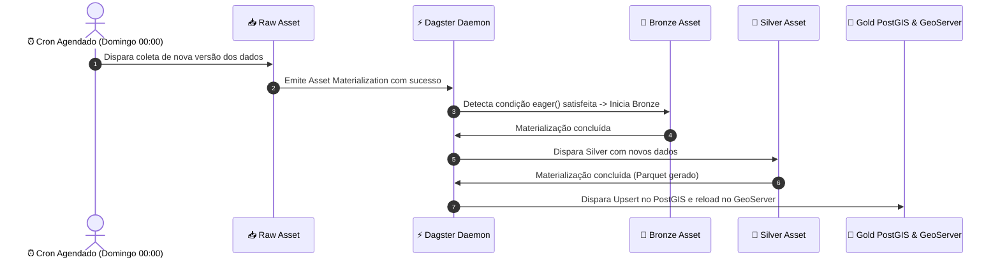

O pipeline do Urbis Datalake utiliza a abordagem de **Auto-Materialização Declarativa (Declarative Asset Reconciliation)** do Dagster em substituição a jobs cron imperativos tradicionais.

Isso elimina falhas de orquestração ao processar assets particionados dinamicamente e garante que todas as camadas downstream sejam atualizadas assim que novos dados chegarem.

---

## ⚙️ Como Funciona o Fluxo Declarativo



### 1. Agendamento Semanal na Origem (Raw)
Os assets da camada `raw` (dados obtidos via WFS, ArcGIS REST ou scrapers) utilizam uma condição de automação cron semanal:

```python
automation_condition = AutomationCondition.on_cron("0 0 * * 0", "America/Sao_Paulo")
```

Isso garante que todas as origens busquem atualizações automaticamente **todo domingo à meia-noite**.

### 2. Efeito Dominó Eager (Downstream)
Os assets das camadas subsequentes (`bronze`, `silver` e `gold`) são configurados com a política reativa:

```python
automation_condition = AutomationCondition.eager()
```

Assim que um asset pai (`upstream`) for materializado com sucesso, o daemon do Dagster automaticamente escalona uma run para materializar o asset filho (`downstream`).

---

## 🎯 Configuração Centralizada

Para evitar duplicar código de automação em centenas de arquivos de assets, a regra é aplicada de forma programática e declarativa no ponto de entrada `dagster_urbis.py`:

```python
from dagster import AutomationCondition, Definitions

# Aplica cron nos assets Raw e eager() nos demais
raw_assets = [asset.with_automation_condition(AutomationCondition.on_cron("0 0 * * 0", "America/Sao_Paulo")) for asset in raw_definitions]
bronze_assets = [asset.with_automation_condition(AutomationCondition.eager()) for asset in bronze_definitions]
silver_assets = [asset.with_automation_condition(AutomationCondition.eager()) for asset in silver_definitions]
gold_assets = [asset.with_automation_condition(AutomationCondition.eager()) for asset in gold_definitions]

defs = Definitions(
    assets=[*raw_assets, *bronze_assets, *silver_assets, *gold_assets],
    resources=global_resources,
)
```

---

## 🌟 Benefícios Desta Abordagem

- **Suporte Nativo a Partições Dinâmicas**: Assets divididos por setores ou zonas fiscais (ex: lotes cadastrais) recalculam apenas as partições que sofreram mutação na fonte.
- **Resiliência e Consistência de Banco**: Se ocorrer uma inconsistência na camada Bronze, as camadas Silver e Gold não são disparadas para aquele fluxo, preservando o banco PostGIS íntegro.
- **Manutenção Centralizada**: Alterações de periodicidade são configuradas no ponto de entrada global, sem necessidade de editar assets individuais.
