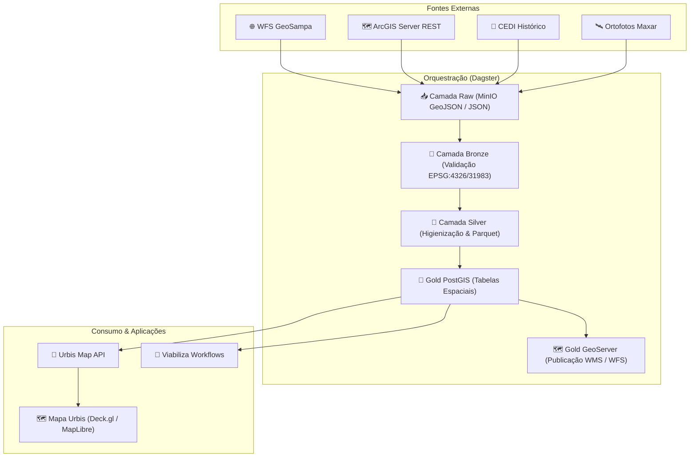

import { Layers, RefreshCw, Cpu, Database, Table } from 'lucide-react';

O **Urbis Datalake** é a espinha dorsal de engenharia de dados geoespaciais e tabulares do ecossistema Urbis. Construído com base no orquestrador **Dagster**, **PostGIS**, **GeoServer** e **MinIO / Azure Blob Storage**, o Datalake é responsável por extrair, padronizar, enriquecer e materializar centenas de camadas geográficas municipais e estaduais (como GeoSampa, IBGE, GeoCATI, IPTU e CEDI).

---

## 🏛️ Pilares da Arquitetura de Dados

---

## 📂 Guias e Tópicos de Dados

<Cards>
  <Card
    key="medalhao"
    href="/docs/datalake/arquitetura-medalhao"
    title="Arquitetura de Medalhão"
    description="Entenda as camadas Raw, Bronze, Silver e Gold (PostGIS e GeoServer)."
    icon={<Layers />}
  />
  <Card
    key="agendamento"
    href="/docs/datalake/agendamento"
    title="Agendamento & Reconciliação"
    description="Auto-materialização declarativa e propagação eager downstream no Dagster."
    icon={<RefreshCw />}
  />
  <Card
    key="gerador"
    href="/docs/datalake/gerador-assets"
    title="Gerador de Assets"
    description="Automação de boilerplate para ingestão de camadas WFS e ArcGIS."
    icon={<Cpu />}
  />
  <Card
    key="remapeamento"
    href="/docs/datalake/remapeamento-colunas"
    title="Remapeamento de Colunas"
    description="Padronização de tipagens, DE-PARAs e nomes legíveis na camada Silver."
    icon={<Table />}
  />
  <Card
    key="catalogo"
    href="/docs/datalake/catalogo"
    title="Catálogo de Camadas"
    description="Catálogo indexado de mais de 7.500 arquivos no Azure Storage e SAS URLs."
    icon={<Database />}
  />
</Cards>

---

## 🛠️ Tecnologias Utilizadas

- **Dagster**: Orquestrador moderno orientado a *Software-Defined Assets* (SDAs).
- **PostgreSQL 16 + PostGIS 3.4**: Banco de dados relacional e motor espacial.
- **GeoServer**: Servidor de mapas para protocolos OGC (WMS/WFS).
- **GeoPandas / Shapely / PyProj**: Manipulação vetorial e transformações cartográficas de alta precisão em Python.
- **MinIO & Azure Blob Storage (`openurbisdatalake`)**: Object storage distribuído para persistência em formato GeoJSON e Parquet.
