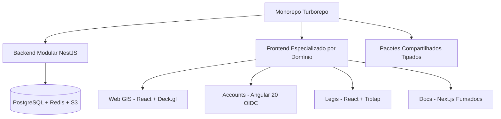

A arquitetura do **Urbis** foi projetada para garantir alta performance cartográfica, desacoplamento de responsabilidades, extensibilidade municipal e segurança rigorosa de dados.

---

## 🧭 Pilares Arquiteturais

---

## 📚 Tópicos de Arquitetura

<Cards>
  <Card
    title="Estrutura do Monorepo"
    href="/docs/general/architecture/monorepo"
    description="Organização das aplicações em apps/ e dos pacotes compartilhados em packages/."
  />
  <Card
    title="Stack Tecnológica"
    href="/docs/general/architecture/stack"
    description="Detalhamento dos frameworks e bibliotecas utilizados no backend e frontend."
  />
  <Card
    title="Arquitetura Frontend"
    href="/docs/general/architecture/frontend"
    description="Estratégia para aplicações React, Angular e biblioteca de UI compartilhada."
  />
  <Card
    title="Arquitetura Backend"
    href="/docs/general/architecture/backend/overview"
    description="Módulos NestJS, injeção de dependências, banco de dados TypeORM e filas."
  />
  <Card
    title="Autenticação e OIDC"
    href="/docs/general/architecture/auth/oidc"
    description="Fluxo de identidade federada, tokens JWT e controle de acesso RBAC."
  />
</Cards>
