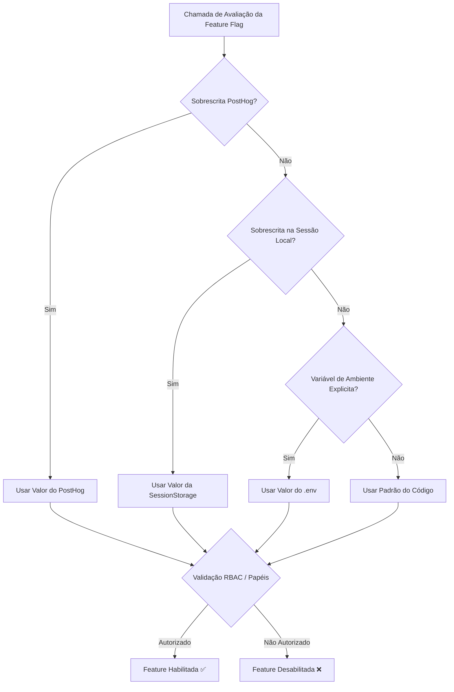

## 🚀 Visão Geral

A plataforma **Urbis** utiliza um sistema unificado de **Feature Flags** em código (`@open-urbis/map-shared`) como **fonte única da verdade** (Single Source of Truth), integrado ao controle de acesso baseado em papéis (**RBAC**) e ao **PostHog** para telemetria, experimentos e acionamento remoto em todos os clientes da solução.

### Aplicativos Atendidos
- **Urbis Map (`apps/web`)**: Painel e mapa interativo GIS.
- **Urbis Accounts (`apps/accounts`)**: Gestão de identidades e chaves de API/WFS.
- **Urbis Legis (`apps/legis`)**: Editor e gestão legislativa territorial.
- **Urbis Site (`apps/site`)**: Portal público.
- **Urbis Docs (`apps/docs`)**: Central de documentação e APIs.
- **Urbis API (`apps/api`)**: Backend NestJS para orquestração e proxy.

---

## 🎛️ Fonte da Verdade Unificada em Código

Todas as flags da aplicação são declaradas e tipadas centralizadamente no pacote `@open-urbis/map-shared/feature-flags`.

### Hierarquia de Resolução de Flags

Ao avaliar se uma funcionalidade está ativa para um usuário, o sistema respeita a seguinte ordem de precedência:



---

## 🔐 Controle de Acesso Baseado em Funções (RBAC)

Mesmo que uma feature flag esteja ativada globalmente ou via ambiente, ela pode ser restrita a perfis específicos por meio da propriedade `roles` ou `roleIds`.

### Regra de Avaliação RBAC
1. **Pública / Irrestrita:** Se `roles` e `roleIds` forem vazios/indefinidos, qualquer usuário (autenticado ou anônimo) tem acesso.
2. **Administrador Master (`admin`):** Usuários com o papel de Administrador Master (ID de role `f5fe5a01-b8e8-4f45-8701-45a6b24ba2d4`) possuem acesso irrestrito às ferramentas administrativas.
3. **Restrição por Role:** Se o usuário possuir uma das funções declaradas na lista `roles` da regra, o acesso é concedido.

```typescript
import { evaluateFeatureFlag } from "@open-urbis/map-shared";

const canManageLayers = evaluateFeatureFlag("manageLayers", {
  isAdmin: true, // ou derivado do perfil do usuário
  userRoles: ["admin"],
});
```

---

## 📊 Integração Unificada com PostHog

O **PostHog** está integrado nativamente em todos os clientes para capturar eventos de uso, identificação automática de sessão e sincronização remota de feature flags.

### Variáveis de Ambiente para o PostHog

Em cada cliente, as variáveis de ambiente devem ser configuradas de acordo com o bundler do projeto:

| Cliente | Variável de Chave (Key) | Variável do Host |
| :--- | :--- | :--- |
| `apps/web` | `VITE_POSTHOG_KEY` | `VITE_POSTHOG_HOST` |
| `apps/legis` | `VITE_POSTHOG_KEY` | `VITE_POSTHOG_HOST` |
| `apps/site` | `VITE_POSTHOG_KEY` | `VITE_POSTHOG_HOST` |
| `apps/accounts` | `VITE_POSTHOG_KEY` | `VITE_POSTHOG_HOST` |
| `apps/docs` | `NEXT_PUBLIC_POSTHOG_KEY` | `NEXT_PUBLIC_POSTHOG_HOST` |
| `apps/api` | `POSTHOG_KEY` | `POSTHOG_HOST` |

> ℹ️ **Nota de Resiliência:** Caso a chave do PostHog não seja fornecida no ambiente, a biblioteca entra em modo *noop* seguro, garantindo que nenhum erro afete a experiência do usuário.

### Identificação Automática do Usuário

A autenticação centralizada em `@open-urbis/map-auth` identifica automaticamente o usuário no PostHog assim que o login é efetuado, sincronizando o ID do usuário (`sub`), e-mail e nome, e limpando a sessão no logout:

```typescript
// Sincronizado automaticamente no login via @open-urbis/map-auth
identifyUser(user.profile.sub, {
  email: user.profile.email,
  name: user.profile.name,
});
```

---

## 📋 Catálogo Unificado de Feature Flags

Abaixo estão listadas todas as feature flags registradas na **fonte da verdade em código** (`DEFAULT_FEATURE_FLAGS`):

| Chave (Key) | Nome | Categoria | Estado Padrão | Restrição RBAC |
| :--- | :--- | :--- | :--- | :--- |
| `manageLayers` | Gerenciador de Camadas | `map` | `Habilitado` | `admin` |
| `baseMaps` | Seleção de Mapas Base | `map` | `Habilitado` | Público |
| `mapFeatures` | Funcionalidades Avançadas do Mapa | `map` | `Habilitado` | `admin` |
| `digitalAddress` | Endereço Digital (Plus Code) | `map` | `Habilitado` | Público |
| `goTo` | Navegação por Coordenadas | `map` | `Habilitado` | `admin` |
| `concatenatedSearch` | Busca Concatenada | `map` | `Habilitado` | `admin` |
| `geoJsonSearch` | Busca e Upload de GeoJSON | `map` | `Habilitado` | `admin` |
| `prospectiveSearch` | Busca Prospectiva Urbanística | `map` | `Habilitado` | `admin` |
| `library` | Biblioteca de Legislação no Mapa | `map` | `Habilitado` | `admin` |
| `threeD` | Visualização 3D | `map` | `Habilitado` | `admin` |
| `fiu` | Ficha de Informação Urbanística | `map` | `Habilitado` | `admin` |
| `legisEditor` | Editor Avançado do Legis | `legis` | `Habilitado` | `admin` |
| `legisDiffViewer` | Visualizador de Alterações de Lei | `legis` | `Habilitado` | Público |
| `accountsApiKeys` | Gestão de Chaves de API (WFS) | `accounts` | `Habilitado` | `admin` |
| `docsSearch` | Busca Interativa de Documentação | `docs` | `Habilitado` | Público |
| `analyticsTracking` | Telemetria e Analytics (PostHog) | `common` | `Habilitado` | Público |

---

## 💻 Exemplos Práticos de Uso

### 1. No Urbis Map / React / Preact (`apps/web`)

```tsx
import { enabledFeatureFlags, isFeatureEnabled } from "@/features/feature-flags";

export function MapControls() {
  const features = enabledFeatureFlags.value;

  return (
    <div>
      {features.manageLayers && <LayerManagerButton />}
      {features.threeD && <ThreeDViewerButton />}
    </div>
  );
}
```

### 2. Disparo Manual de Eventos PostHog

```typescript
import { trackEvent } from "@open-urbis/map-shared";

trackEvent("search_executed", {
  query: "Lote 123",
  category: "prospective",
});
```

### 3. No Backend NestJS (`apps/api`)

```typescript
import { Injectable } from "@nestjs/common";
import { PostHogService } from "./common/posthog/posthog.service";

@Injectable()
export class LoteService {
  constructor(private readonly posthogService: PostHogService) {}

  async consultLote(userId: string, loteId: string) {
    this.posthogService.capture({
      distinctId: userId,
      event: "lote_consulted",
      properties: { loteId },
    });
  }
}
```
