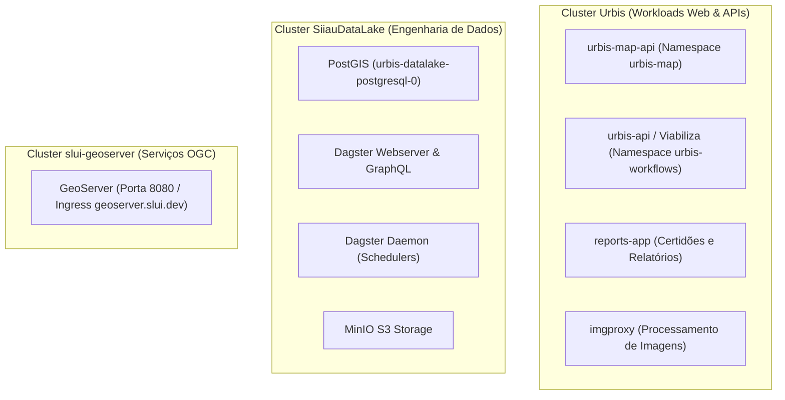

Este documento consolida o mapeamento de toda a infraestrutura em nuvem do ecossistema Urbis provisionada na **Microsoft Azure**.

---

## 🏛️ 1. Resource Groups Principais

| Resource Group | Região | Finalidade |
| :--- | :--- | :--- |
| **`Urbis`** | `southcentralus` / `eastus` / `brazilsouth` | Recursos de produção do ecossistema Urbis (AKS, Static Web Apps, PostgreSQL, CDN, Redis). |
| **`saade_group`** | `brazilsouth` / `eastus` | Storage Accounts do Datalake (`openurbisdatalake`, `siiau`, `slui`) e orquestração. |
| **`ckan-codata` / `ckan-orcamento`** | `brazilsouth` / `eastus` | Portais CKAN e dados abertos complementares. |
| **`geocoding-codata`** | `eastus` | Microsserviços de geocodificação territorial. |

---

## ☸️ 2. Clusters Kubernetes (Azure AKS)

O ecossistema é distribuído em **3 clusters gerenciados**:

### Detalhes dos Clusters:

| Cluster AKS | Resource Group | Contexto kubectl | Principais Workloads |
| :--- | :--- | :--- | :--- |
| **`Urbis`** | `Urbis` | `Urbis` | `urbis-map-api` (Load Balancer `20.81.92.24`), `urbis-api` Viabiliza (Load Balancer `48.194.84.65`), `reports-app`, `imgproxy`. |
| **`SiiauDataLake`** | `saade_group` | `SiiauDataLake` | **Datalake PostGIS** (`urbis-datalake-postgresql`), Dagster Webserver/Daemon, Ingress `datalake.urbis.prefeitura.sp.gov.br`. |
| **`slui-geoserver`** | `saade_group` | `slui-geoserver` | **GeoServer REST API** (`geoserver` porta 8080), Ingress `geoserver.slui.dev`, serviços WMS/WFS. |

---

## 🗄️ 3. Bancos de Dados Gerenciados & Caches

| Recurso | Tipo | Resource Group | Região | Detalhes |
| :--- | :--- | :--- | :--- | :--- |
| **`urbis-map-1`** | Azure Database for PostgreSQL Flexible Server | `Urbis` | `brazilsouth` | Banco primário PostGIS contendo camadas municipais, dados fiscais e cadastros de SQLs. |
| **`UrbisMap`** | Azure Cache for Redis Enterprise | `Urbis` | `brazilsouth` | Cache de alta performance para tiles cartográficos, sessões OIDC e queries espaciais. |

---

## 🌊 4. Storage Accounts

| Storage Account | Resource Group | Região | Finalidade |
| :--- | :--- | :--- | :--- |
| **`openurbisdatalake`** | `saade_group` | `brazilsouth` | Datalake principal com +7.500 camadas (`geojson`, `parquet`, `raw-maxar`, `dagster-storage`). |
| **`urbispublic`** | `Urbis` | `eastus` | Hospedagem de assets públicos e arquivos estáticos. |
| **`siiau`** | `saade_group` | `eastus` | Bases territoriais e cadastrais legadas. |
| **`slui`** | `saade_group` | `brazilsouth` | Bases de licenciamento urbanístico. |

---

## 🌐 5. Aplicações Web (Azure Static Web Apps)

| Aplicação | Recurso Azure | Localização | Descrição |
| :--- | :--- | :--- | :--- |
| **Mosaico (Portal)** | `UrbisSite` | `centralus` | Interface de busca por SQL, endereço e coordenadas. |
| **Mapa Urbis** | `UrbisMap` | `centralus` | Visualizador web com camadas georreferenciadas e ferramentas analíticas. |
| **Legis** | `UrbisLegis` | `centralus` | Editor e visualizador explicativo da legislação territorial (PDE, LPUOS). |
| **Docs Técnica** | `UrbisDocs` | `centralus` | Portal de documentação técnica para desenvolvedores e integradores. |
| **Accounts** | `UrbisContas` | `centralus` | Gestão de identidade e autenticação OIDC de cidadãos e servidores. |
