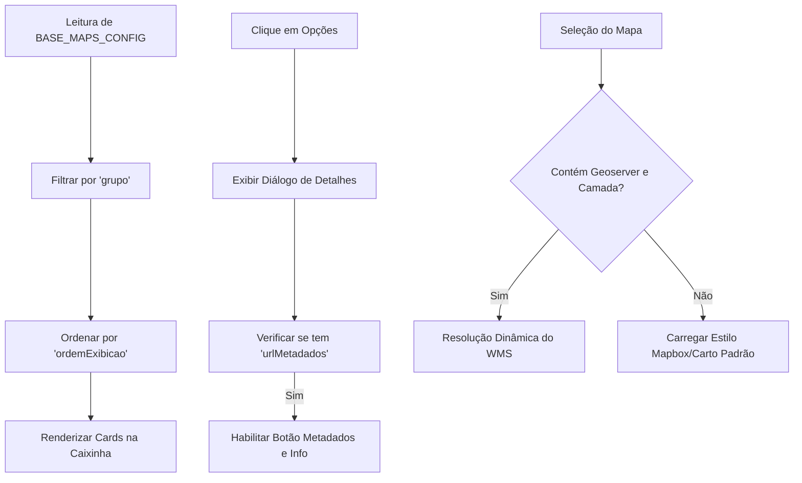

## 🚀 Visão Geral

A plataforma **Urbis** utiliza uma estrutura de configuração unificada em código para os **Mapas-base** (camadas de fundo do mapa, como satélite, arruamento e ortofotos históricas). Essa estrutura serve como a **fonte única da verdade** (Single Source of Truth) para o carregamento, ordenação, renderização e detalhes de metadados em todos os componentes visuais do ecossistema.

### Aplicativos Atendidos
- **Urbis Map (`apps/web`)**: Painel de controle de camadas (`LayerController`) e seletor flutuante (`BaseMapSelector`).
- **Urbis Docs (`apps/docs`)**: Central de documentação e guia de operação técnica.

---

## 🎛️ Fonte da Verdade Unificada em Código

Todos os mapas-base disponíveis na plataforma são declarados, tipados e configurados centralizadamente no arquivo de estilos do mapa:
📂 `apps/web/src/components/MapView/base-map-styles.ts`

### Estrutura e Resolução do Fluxo de Renderização

Ao renderizar a caixinha de mapas-base, o Urbis lê a lista declarativa e gera dinamicamente os estilos e os modais de informações:



---

## 📝 O Modelo de Dados (`BaseMapConfig`)

Cada mapa-base cadastrado na lista `BASE_MAPS_CONFIG` segue a seguinte tipagem TypeScript:

```typescript
export interface BaseMapConfig {
  id: BaseMapStyleId;                          // Identificador único (sem espaços ou acentos)
  grupo: "Bases oficiais" | "Bases não oficiais"; // Agrupamento visual na caixinha
  ordemExibicao: number;                       // Ordem numérica de renderização
  tipo: "ortofoto" | "satélite" | "mapa";      // Tipo de dado (define o ícone correspondente)
  nome: string;                                // Título legível exibido ao usuário
  descricao: string;                           // Pequena sinopse ou resumo do mapa
  urlMiniatura: string;                        // Caminho relativo para a capa (/capa.jpg)
  urlMetadados?: string;                       // Link opcional do catálogo de metadados
  urlGeoserver?: string;                       // Link opcional do servidor de mapas (WMS)
  camada?: string;                             // Nome técnico opcional da camada WMS
}
```

---

## 📂 Gerenciamento de Miniaturas e Resolução Case-Sensitive

Para evitar quebras de carregamento de imagem em servidores de produção Linux (que são estritamente case-sensitive) e problemas de codificação Unicode (NFC vs NFD), todas as imagens de capa devem seguir os seguintes padrões:

1. **Localização Física**: As imagens devem ser salvas exclusivamente na pasta:
   📂 `apps/web/public/`
2. **Nome de Arquivo**: Devem ser gravadas utilizando letras **minúsculas**, **sem acentos** e substituindo espaços por **sublinhados** (`_`) ou hifens (`-`).
   - *Correto*: `ortofoto_2020.jpg`
   - *Incorreto*: `Ortofoto 2020.jpg` ou `Ortofoto_2020.jpg`

> ⚠️ **Atenção (macOS/Git):** Sistemas macOS são case-insensitive. Se você renomear um arquivo de `Claro.jpg` para `claro.jpg` diretamente no Finder, o Git pode não registrar a alteração. Sempre force a mudança de casing no Git usando:
> `git mv -f apps/web/public/Claro.jpg apps/web/public/claro.jpg`

---

## 📋 Catálogo Declarativo Atual de Mapas-base

Abaixo estão listados os mapas-base atualmente configurados na fonte da verdade unificada:

| ID | Nome | Grupo | Tipo / Ícone | URL da Miniatura | Camada (WMS) |
| :--- | :--- | :--- | :--- | :--- | :--- |
| `geosampa-ortofoto-2020` | Ortofoto 2020 | `Bases oficiais` | `ortofoto` (Camera 📷) | `/ortofoto_2020.jpg` | `ORTO_RGB_2020` |
| `geosampa-ortofoto-2017` | Ortofoto 2017 | `Bases oficiais` | `ortofoto` (Camera 📷) | `/ortofoto_2017.jpg` | `Orto_PMD_RGB_2017` |
| `geosampa-hillshade-mdc-2004` | Ortofoto 2004 | `Bases oficiais` | `ortofoto` (Camera 📷) | `/ortofoto_2004.jpg` | `Orto_MDC` |
| `geosampa-vasp-cruzeiro-1954` | VASP Cruzeiro 1954 | `Bases oficiais` | `ortofoto` (Camera 📷) | `/vasp_cruzeiro_1954.jpg` | `Vasp_Cruzeiro` |
| `geosampa-sara-brasil-1930` | Sara Brasil 1930 | `Bases oficiais` | `mapa` (Map 🗺️) | `/sara_brasil_1930.jpg` | `SaraBrasil_1930` |
| `openfreemap-liberty` | Mapa Urbano Vetorial | `Bases não oficiais` | `mapa` (Map 🗺️) | `/openfreemap_3d.jpg` | *N/A (OpenFreeMap / OSM)* |
| `openfreemap-positron` | Claro Minimalista | `Bases não oficiais` | `mapa` (Map 🗺️) | `/positron.jpg` | *N/A (OpenFreeMap)* |
| `openfreemap-bright` | Colorido Urbano | `Bases não oficiais` | `mapa` (Map 🗺️) | `/bright.jpg` | *N/A (OpenFreeMap)* |
| `standard` | OpenStreetMap | `Bases não oficiais` | `mapa` (Map 🗺️) | `/padrao.jpg` | *N/A (OpenStreetMap)* |
| `outdoors` | Topográfico | `Bases não oficiais` | `mapa` (Map 🗺️) | `/topografico.jpg` | *N/A (Esri)* |
| `satellite` | Satélite | `Bases não oficiais` | `satélite` (Satellite 🛰️) | `/satelite.jpg` | *N/A (Esri / Maxar)* |
| `satellite-streets` | Satélite com ruas | `Bases não oficiais` | `satélite` (Satellite 🛰️) | `/hibrido.jpg` | *N/A (Esri)* |

> 💡 **Visualização 3D Transversal:** O recurso de **Visualização 3D** (extrusão volumétrica de edificações baseada em OpenMapTiles) é transversal e pode ser habilitado sobre **qualquer mapa base** (Ortofoto 2020, Satélite, Mapa Urbano Vetorial, etc.), permitindo calibrar sua opacidade individual para visualização enriquecida do território.

---

## 💻 Como Adicionar ou Atualizar um Mapa-base

Para adicionar ou modificar um mapa base, siga os três passos abaixo:

### Passo 1: Adicionar a miniatura
Cole a imagem de capa desejada dentro da pasta `apps/web/public/` seguindo a convenção de letras minúsculas (ex: `meu_novo_mapa.jpg`).

### Passo 2: Cadastrar no arquivo de configuração
Abra o arquivo `apps/web/src/components/MapView/base-map-styles.ts` e insira o novo objeto dentro do array `BASE_MAPS_CONFIG`.

```typescript
  {
    id: "geosampa-meu-novo-mapa",
    grupo: "Bases oficiais",
    ordemExibicao: 6,
    tipo: "ortofoto",
    nome: "Meu Novo Mapa 2026",
    descricao: "Levantamento cartográfico de alta resolução de 2026.",
    urlMiniatura: "/meu_novo_mapa.jpg",
    urlGeoserver: "https://raster.geosampa.prefeitura.sp.gov.br/geoserver/web",
    camada: "Meu_Novo_Mapa",
    urlMetadados: "http://catalogo.geoportal.prodam/geonetwork/srv/por/catalog.search#/metadata/meu-id"
  }
```

### Passo 3: Registrar o tipo do ID (Se for WMS Novo)
Adicione o identificador ao tipo `BaseMapStyleId` localizado no topo de `base-map-styles.ts` para que o compilador do TypeScript valide a integridade do seletor:

```typescript
export type BaseMapStyleId =
  | "standard"
  // ...
  | "geosampa-vasp-cruzeiro-1954"
  | "geosampa-meu-novo-mapa"; // Adicione aqui seu id
```
