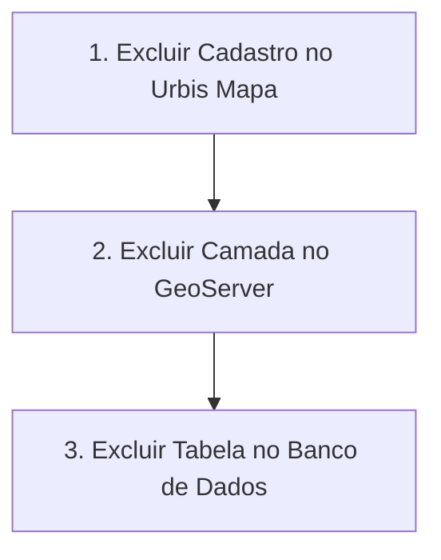

Este documento descreve o procedimento passo a passo em texto para realizar a **exclusão completa e definitiva** de uma camada. A exclusão abrange a remoção do cadastro na área administrativa do Urbis, a despublicação dos serviços WMS/WFS no GeoServer e a deleção da tabela física no banco de dados PostgreSQL/PostGIS.

> [!CAUTION]
> **Atenção**: A remoção no banco de dados é uma ação destrutiva e irreversível. Certifique-se de realizar backups dos dados ou confirmar que a camada não é mais necessária antes de prosseguir.

---

## Ordem Recomendada de Exclusão

Para evitar erros de sincronização e requisições quebradas no frontend enquanto o mapa está em uso por usuários ativos, siga rigorosamente a ordem abaixo:



1. **1º Passo: Área Administrativa do Urbis Mapa** — Remove as referências do catálogo e esconde a camada dos usuários no frontend.
2. **2º Passo: GeoServer** — Interrompe os serviços de mapa (WMS) e de feições (WFS).
3. **3º Passo: Banco de Dados PostgreSQL/PostGIS** — Remove fisicamente a tabela espacial e limpa o armazenamento.

---

## Passo 1: Exclusão na Área Administrativa do Urbis Mapa

O primeiro passo é remover a camada do cadastro do sistema Urbis para que ela deixe de ser requisitada pelos usuários.

### Procedimento

1. Acesse o sistema Urbis Web e faça login com uma conta que possua permissões administrativas (`layer-schema:delete`).
2. No canto superior direito da tela do mapa, clique no botão **Administração**.
3. No menu lateral esquerdo da área administrativa, acesse o item **Camadas**.
4. Localize a camada desejada na lista de esquemas de camadas (*Layer Schemas*). Você pode utilizar a barra de busca ou filtrar por grupo.
5. Na linha da camada correspondente, clique no botão/ícone de **Excluir** (representado por uma lixeira).
6. Uma caixa de confirmação será exibida na tela. Leia o aviso e confirme a exclusão.

### Resultado Esperado

- A camada deixará de aparecer no catálogo do mapa para os usuários finais.
- As configurações de estilos, visualização (*view template*), mapeamento de propriedades e filtros associados ao registro da camada serão removidas do banco do Urbis.

---

## Passo 2: Exclusão no GeoServer

Após remover o cadastro no Urbis, despublique os serviços da camada no GeoServer para liberar recursos da aplicação de geoprocessamento.

### Procedimento

1. Acesse o painel de administração Web do GeoServer (exemplo: `https://geoserver.<seu-dominio>/geoserver`).
2. Realize o login com as credenciais de administrador do GeoServer.
3. No menu lateral esquerdo, sob a seção **Dados** (*Data*), clique em **Camadas** (*Layers*).
4. No campo de busca, digite o nome da camada ou selecione o *Workspace* ao qual ela pertence.
5. Marque a caixa de seleção ao lado da camada que deseja remover.
6. Clique no botão **Remover camadas selecionadas** (*Remove selected layers*) localizado no topo ou rodapé da tabela.
7. Confirme a remoção quando solicitado.

### Removendo o Depósito de Dados (Store) — Opcional

Se o Depósito de Dados (*Store*) no GeoServer tiver sido criado exclusivamente para essa camada:

1. No menu lateral esquerdo, em **Dados**, clique em **Depósitos de dados** (*Stores*).
2. Localize a *Store* vinculada à camada removida.
3. Selecione a *Store* e clique em **Remover depósitos de dados selecionados** (*Remove selected stores*).
4. Confirme a exclusão.

### Resultado Esperado

- As rotas dos serviços WMS e WFS associadas a essa camada retornarão HTTP 404 (Not Found).
- O GeoServer deixará de manter cache de tiles ou definições de estilo (SLD/SE) para a camada.

---

## Passo 3: Exclusão no Banco de Dados (PostgreSQL / PostGIS)

A última etapa é a remoção da tabela espacial física no PostgreSQL/PostGIS para liberar o espaço no disco.

### 1. Conectar ao Servidor PostgreSQL

Você pode conectar-se ao banco de dados utilizando a CLI `psql`, uma ferramenta de gerenciamento como DBeaver/pgAdmin ou via terminal no pod do Kubernetes/Docker.

Exemplo de comando via terminal CLI (`psql`):

```bash
export PGPASSWORD='<sua_senha_admin>'

psql "host=<seu-postgres-host>.postgres.database.azure.com port=5432 dbname=urbis user=postgres sslmode=require"
```

> [!NOTE]
> Ajuste os parâmetros `host`, `dbname` e `user` conforme o seu ambiente (Staging ou Produção).

### 2. Identificar a Tabela Espacial

Certifique-se do nome correto do schema e da tabela antes de executar a exclusão. Para listar tabelas relacionadas no schema atual:

```sql
SELECT table_schema, table_name 
FROM information_schema.tables 
WHERE table_schema = 'public' 
  AND table_name LIKE '%nome_aproximado%';
```

### 3. Executar a Exclusão da Tabela

Para remover uma **tabela física** contendo as geometrias e atributos da camada, execute o comando SQL:

```sql
DROP TABLE IF EXISTS public.nome_da_tabela CASCADE;
```

> [!IMPORTANT]
> O parâmetro `CASCADE` garante que restrições de chave estrangeira, views dependentes ou índices associados a esta tabela também sejam removidos automaticamente.

Caso a camada no GeoServer tenha sido publicada a partir de uma **View SQL** em vez de uma tabela física:

```sql
DROP VIEW IF EXISTS public.vw_nome_da_tabela CASCADE;
```

### 4. Confirmar a Exclusão

Para validar que a tabela foi efetivamente removida do banco de dados:

```sql
SELECT EXISTS (
   SELECT FROM information_schema.tables 
   WHERE table_schema = 'public'
     AND table_name = 'nome_da_tabela'
);
```

Se o retorno for `f` (falso), a tabela foi totalmente removida.

---

## Checklist de Validação Final

Ao concluir os três passos, valide o resultado final:

- [ ] **Mapa Urbis**: A camada não é exibida na lista do menu lateral e não gera chamadas de rede no navegador ao abrir o mapa.
- [ ] **GeoServer**: A requisição para a URL do WMS/WFS da camada não retorna mais dados de feições ou imagens.
- [ ] **Banco de Dados**: A execução de `SELECT count(*) FROM public.nome_da_tabela;` no PostgreSQL indica erro de tabela inexistente.
