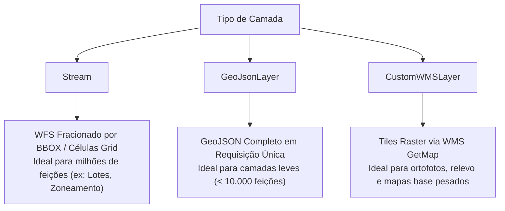

import { Callout } from 'fumadocs-ui/components/callout';
import { Tab, Tabs } from 'fumadocs-ui/components/tabs';

Este documento é a referência canônica para a estruturação dos esquemas JSON de camadas no Urbis Map. Seguir rigorosamente as especificações abaixo garante máxima compatibilidade entre o **Datalake (ingestão automatizada)**, o **Painel Administrativo do Mapa (`LayerHandle`)** e o **mecanismo de renderização visual (Deck.gl / MapView)**, eliminando bugs como polígonos invisíveis/transparentes ou perda de configurações ao editar no Admin.

---

## Índice

1. [Tipos de Camadas (`type`)](#1-tipos-de-camadas-type)
   - [Modo `Stream` (WFS Dinâmico em Grade)](#modo-stream-wfs-dinâmico-em-grade)
   - [Modo `GeoJsonLayer` (Vetorial Estático)](#modo-geojsonlayer-vetorial-estático)
   - [Modo `CustomWMSLayer` (Raster / Imagem)](#modo-customwmslayer-raster--imagem)
2. [Configuração Universal de Cores (`colors`)](#2-configuração-universal-de-cores-colors)
   - [Formato Obrigatório de Cor RGBA](#formato-obrigatório-de-cor-rgba)
   - [Declaração Dupla: `value` e `label` para Máxima Compatibilidade](#declaração-dupla-value-e-label-para-máxima-compatibilidade)
   - [Tipos de Cor no Admin (`fill`, `line`, `text`)](#tipos-de-cor-no-admin-fill-line-text)
   - [Fallback de Cor Padrão (`default`)](#fallback-de-cor-padrão-default)
3. [Padrões de Preenchimento e Hachuras (`pattern` e `patternConfig`)](#3-padrões-de-preenchimento-e-hachuras-pattern-e-patternconfig)
4. [Especificação Completa de Propriedades (`properties`)](#4-especificação-completa-de-propriedades-properties)
5. [Ações no Clique (`clickAction`)](#5-ações-no-clique-clickaction)
6. [Exemplos Canônicos Prontos para Datalake e Seeds](#6-exemplos-canônicos-prontos-para-datalake-e-seeds)
   - [Exemplo 1: Lotes Fiscais (`Stream` com cor visível e contorno)](#exemplo-1-lotes-fiscais-stream-com-cor-visível-e-contorno)
   - [Exemplo 2: Zoneamento (`Stream` com Cores Dinâmicas e Hachuras)](#exemplo-2-zoneamento-stream-com-cores-dinâmicas-e-hachuras)
   - [Exemplo 3: Equipamentos e Áreas Públicas (`GeoJsonLayer`)](#exemplo-3-equipamentos-e-áreas-públicas-geojsonlayer)
   - [Exemplo 4: Camada Raster / Imagem (`CustomWMSLayer`)](#exemplo-4-camada-raster--imagem-customwmslayer)

---

## 1. Tipos de Camadas (`type`)

O Urbis suporta 3 tipos fundamentais de camada:



### Modo `Stream` (WFS Dinâmico em Grade)
- **Quando usar:** Camadas com alto volume de feições poligonais ou lineares (ex.: Lotes Fiscais, Zoneamento, Calçadas, Vias, Vegetação).
- **Como funciona:** O frontend fatia a janela visível (*viewport*) em células de grid dinâmicas (`calculateGridCells`). Cada célula dispara uma requisição WFS com `bbox=minLon,minLat,maxLon,maxLat,CRS:84`.
- **Exigências:**
  - `origin` deve apontar para o endpoint WFS do GeoServer.
  - `minZoom` recomendado `>= 13` (para lotes detalhados, `>= 17`).
  - O GeoServer **deve** possuir coluna de geometria válida no schema da camada (evitando erro de *Illegal property name*).

### Modo `GeoJsonLayer` (Vetorial Estático)
- **Quando usar:** Camadas de abrangência municipal fixa ou com número reduzido de polígonos (ex.: Limites de Município, Distritos, Subprefeituras, Macroáreas).
- **Como funciona:** O Deck.gl faz o download integral do GeoJSON uma única vez ao ativar a camada.

### Modo `CustomWMSLayer` (Raster / Imagem)
- **Quando usar:** Camadas geradas como imagem matricial pelo GeoServer (ex.: Ortofotos, Águas Correntes Estimadas, Relevo).
- **Exigências:**
  - `origin` deve ser a URL do endpoint WMS (`request=GetMap`).
  - `properties.wms` deve conter os parâmetros `layers`, `version` e `format`.

---

## 2. Configuração Universal de Cores (`colors`)

Para garantir que a cor **nunca fique transparente ou desapareça** e que seja **100% editável pelo Painel Administrativo (`LayerHandle`)**, siga as regras a seguir:

### Formato Obrigatório de Cor RGBA

O motor visual Deck.gl interpreta cores como um array de 4 números inteiros de **0 a 255**:

`[R, G, B, A]` onde cada canal deve ser um número inteiro entre `0` e `255`.

<Callout type="error">
  **Erros Comuns que Causam Polígonos Transparentes ou Invisíveis:**
  1. **Alfa Decimal (0.0 a 1.0):** O Deck.gl interpreta `[255, 0, 0, 0.8]` como alfa `0` (completamente transparente), pois espera valores inteiros de 0 a 255. Use sempre `[255, 0, 0, 204]`.
  2. **Alfa Zerado:** `[200, 200, 200, 0]` faz o preenchimento ser desenhado invisível. Para preenchimento sólido semitransparente, utilize alfas entre `150` e `240`.
  3. **String Hexadecimal no Array:** `["#FF0000"]` quebra a GPU do Deck.gl. O campo `color` deve ser sempre um array numérico: `[255, 0, 0, 255]`.
</Callout>

### Declaração Dupla: `value` e `label` para Máxima Compatibilidade

O sistema do Urbis utiliza o array `colors` em três subsistemas diferentes:
1. **Renderizador Deck.gl (`generateGetColorFns`):** Procura a cor pela chave `color.value ?? color.label ?? "default"`.
2. **Legenda do Mapa (`MapLegend`):** Exibe o texto configurado em `color.label`.
3. **Painel Administrativo (`parseLayerSchemaToForm`):** Agrupa os elementos de formulário por `color.value || color.label`.

<Callout type="info">
  **Regra de Ouro:** Sempre declare **ambos** os campos `value` e `label` em todos os itens do array `colors`. Em camadas de cor única (estáticas), use `"default"` ou o nome da camada.
</Callout>

### Tipos de Cor no Admin (`fill`, `line`, `text`)

Para que o formulário administrativo reconheça separadamente a **cor de preenchimento**, a **cor da borda/linha** e a **cor do texto** do mesmo elemento, declare entradas associadas através do campo `type`:

| `type` | Aplicação | Descrição |
| :--- | :--- | :--- |
| `undefined` ou `"fill"` | Preenchimento do Polígono | Cor principal da área |
| `"line"` | Contorno / Linha / Borda | Cor das arestas do polígono |
| `"text"` | Rótulo de Texto | Cor do texto renderizado dentro da feição |

### Fallback de Cor Padrão (`default`)

Quando uma feição possui uma propriedade que não consta no mapeamento `colors`, ou quando `getFillColorPropName` não é especificado, o sistema busca a chave `"default"`. **Sempre inclua uma entrada com `value: "default"` ou `label: "default"` no array de cores.**

---

## 3. Padrões de Preenchimento e Hachuras (`pattern` e `patternConfig`)

O campo `pattern` permite aplicar texturas e hachuras gráficas sobre o preenchimento do polígono:

| Padrão (`pattern`) | Descrição Visual |
| :--- | :--- |
| `full` | Preenchimento sólido tradicional (padrão se omitido). |
| `dots` | Matriz de pontos dispersos. |
| `hatch-1x` | Linhas diagonais paralelas simples inclinadas para a direita (`/`). |
| `hatch-1x-reverse` | Linhas diagonais paralelas simples inclinadas para a esquerda (`\`). |
| `hatch-2x` | Linhas diagonais com o dobro de densidade (`//`). |
| `hatch-2x-reverse` | Linhas diagonais inversas de alta densidade (`\\`). |
| `hatch-cross` | Linhas diagonais cruzadas em "X" (*cross-hatch*). |
| `hatch-horizontal` | Linhas retas horizontais paralelas. |
| `hatch-vertical` | Linhas retas verticais paralelas. |
| `hatch-grid` | Grade xadrez com linhas ortogonais horizontais e verticais. |

### Configuração de Escala e Deslocamento (`patternConfig`)

```json
{
  "pattern": "hatch-1x",
  "patternConfig": {
    "getFillPatternScale": 0.5,
    "getFillPatternOffset": [0, 0]
  }
}
```
- `getFillPatternScale`: Número entre `0.1` e `5.0`. Valores menores geram traços mais finos e espaçamento mais denso (recomendado: `0.3` a `1.0`).
- `getFillPatternOffset`: Deslocamento `[x, y]` em fração do tile para alinhamento.

---

## 4. Especificação Completa de Propriedades (`properties`)

O objeto `properties` configura o comportamento e estilização gráfica no Deck.gl e no portal:

| Propriedade | Tipo | Valor Recomendado | Descrição |
| :--- | :--- | :--- | :--- |
| `filled` | `boolean` | `true` | Habilita a renderização do preenchimento dos polígonos. |
| `stroked` | `boolean` | `true` | Habilita a renderização das linhas de contorno. |
| `pointType` | `string` | `"circle"` | Tipo de geometria para pontos (`"circle"` ou `"circle+text"`). |
| `getLineWidth` | `number` | `1` ou `2` | Espessura das linhas de contorno em pixels. |
| `lineWidthMinPixels` | `number` | `1` | Garante que a borda continue visível mesmo com zoom distante. |
| `pickable` | `boolean` | `true` | Torna o polígono clicável e interativo. |
| `autoHighlight` | `boolean` | `true` | Ativa realce luminoso ao passar o cursor do mouse. |
| `visualState.hoverColor` | `number[]` | `[255, 255, 255, 90]` | Cor RGBA de realce no hover do mouse. |
| `visualState.selectedColor`| `number[]` | `[255, 220, 0, 220]` | Cor RGBA ao selecionar o polígono. |
| `includeInAnalysis` | `boolean` | `true` | Habilita a camada no motor de análise territorial. |
| `includeInFiu` | `boolean` | `true` | Habilita a camada na Ficha de Informação Urbanística. |
| `attributeMapping` | `object` | `{ "campo": { "label": "Nome Amigável" } }` | Dicionário de títulos amigáveis para a tabela de atributos. |
| `extruded` | `boolean` | `false` | Se `true`, eleva os polígonos em 3D. |
| `getElevation` | `string` | `"15"` ou função JS | Altura de extrusão 3D (número fixo ou função `(d) => ...`). |

---

## 5. Ações no Clique (`clickAction`)

Define o comportamento ao clicar em um polígono da camada:

<Tabs items={['SelectFeature (Padrão)', 'setZoom', 'OpenAttributesTable']}>
  <Tab value="SelectFeature (Padrão)">
    Abre o painel lateral com as informações detalhadas e o `viewTemplate`:
    ```json
    {
      "clickAction": {
        "action": "SelectFeature",
        "params": { "zoom": 18 }
      }
    }
    ```
  </Tab>
  <Tab value="setZoom">
    Apenas aproxima a câmera no ponto clicado:
    ```json
    {
      "clickAction": {
        "action": "setZoom",
        "params": { "zoom": 17 }
      }
    }
    ```
  </Tab>
  <Tab value="OpenAttributesTable">
    Abre a gaveta inferior com a tabela completa de atributos da camada:
    ```json
    {
      "clickAction": {
        "action": "OpenAttributesTable"
      }
    }
    ```
  </Tab>
</Tabs>

---

## 6. Exemplos Canônicos Prontos para Datalake e Seeds

Copie e use estes modelos como referência direta para inserções no banco ou ingestões no Datalake:

### Exemplo 1: Lotes Fiscais (`Stream` com cor visível e contorno)

```json
{
  "id": "lotes_fiscais",
  "name": "Lotes fiscais",
  "index": 24,
  "origin": "https://geoserver.slui.dev/geoserver/slui/ows?service=WFS&version=2.0.0&request=GetFeature&typeNames=slui:lote_cidadao&count=10000&outputFormat=application/json&srsName=CRS:84",
  "isActive": true,
  "isSelected": true,
  "isVisible": true,
  "isPublic": true,
  "type": "Stream",
  "minZoom": 17,
  "groupId": "cadastral",
  "getTextColorPropName": null,
  "getFillColorPropName": null,
  "getLineColorPropName": null,
  "clickAction": {
    "action": "SelectFeature",
    "params": { "zoom": 19 }
  },
  "colors": [
    {
      "type": "fill",
      "color": [180, 200, 220, 140],
      "label": "Lote Fiscal",
      "value": "default",
      "pattern": "full"
    },
    {
      "type": "line",
      "color": [30, 60, 90, 255],
      "label": "Lote Fiscal",
      "value": "default"
    }
  ],
  "properties": {
    "filled": true,
    "stroked": true,
    "getLineWidth": 1.5,
    "lineWidthMinPixels": 1,
    "pickable": true,
    "includeInAnalysis": true,
    "includeInFiu": true,
    "visualState": {
      "hoverColor": [255, 255, 255, 120],
      "selectedColor": [255, 200, 0, 200]
    }
  }
}
```

### Exemplo 2: Zoneamento (`Stream` com Cores Dinâmicas e Hachuras)

```json
{
  "id": "zoneamento_lei_16402_18177",
  "name": "Zoneamento",
  "index": 50,
  "origin": "https://geoserver.slui.dev/geoserver/slui/ows?service=WFS&version=2.0.0&request=GetFeature&typeNames=slui:zoneamento&count=10000&outputFormat=application/json&srsName=CRS:84",
  "isActive": true,
  "isSelected": false,
  "isVisible": true,
  "isPublic": true,
  "type": "Stream",
  "minZoom": 13,
  "groupId": "urbanistico",
  "getFillColorPropName": "cd_zoneamento_perimetro",
  "getLineColorPropName": "cd_zoneamento_perimetro",
  "getTextColorPropName": "cd_zoneamento_perimetro",
  "clickAction": {
    "action": "SelectFeature",
    "params": { "zoom": 17.5 }
  },
  "colors": [
    {
      "type": "fill",
      "color": [223, 253, 178, 190],
      "label": "AC-1 (Área de Centralidade)",
      "value": "AC-1",
      "pattern": "full"
    },
    {
      "type": "line",
      "color": [150, 200, 100, 255],
      "label": "AC-1 (Área de Centralidade)",
      "value": "AC-1"
    },
    {
      "type": "fill",
      "color": [223, 253, 178, 190],
      "label": "AC-2 (Hachurado)",
      "value": "AC-2",
      "pattern": "dots",
      "patternConfig": { "getFillPatternScale": 0.5 }
    },
    {
      "type": "fill",
      "color": [173, 160, 152, 190],
      "label": "ZC (Zona Centralidade)",
      "value": "ZC",
      "pattern": "full"
    },
    {
      "type": "fill",
      "color": [173, 160, 152, 190],
      "label": "ZCa (Centralidade com Hachura)",
      "value": "ZCa",
      "pattern": "hatch-1x",
      "patternConfig": { "getFillPatternScale": 0.4 }
    },
    {
      "type": "fill",
      "color": [200, 200, 200, 160],
      "label": "Outros / Padrão",
      "value": "default",
      "pattern": "full"
    }
  ],
  "properties": {
    "filled": true,
    "stroked": true,
    "getLineWidth": 1,
    "lineWidthMinPixels": 1,
    "pickable": true,
    "includeInAnalysis": true,
    "includeInFiu": true
  }
}
```

### Exemplo 3: Equipamentos e Áreas Públicas (`GeoJsonLayer`)

```json
{
  "id": "limites_municipio",
  "name": "Limites do município",
  "index": 20,
  "origin": "https://geoserver.slui.dev/geoserver/slui/ows?service=WFS&version=2.0.0&request=GetFeature&typeNames=slui:limites_municipio&outputFormat=application/json&srsName=CRS:84",
  "isActive": true,
  "isVisible": true,
  "isPublic": true,
  "type": "GeoJsonLayer",
  "minZoom": null,
  "groupId": "limites",
  "colors": [
    {
      "type": "fill",
      "color": [0, 0, 0, 0],
      "label": "Limite Municipal",
      "value": "default"
    },
    {
      "type": "line",
      "color": [10, 10, 10, 255],
      "label": "Limite Municipal",
      "value": "default"
    }
  ],
  "properties": {
    "filled": false,
    "stroked": true,
    "getLineWidth": 3,
    "lineWidthMinPixels": 2,
    "pickable": false
  }
}
```

### Exemplo 4: Camada Raster / Imagem (`CustomWMSLayer`)

```json
{
  "id": "aguas_correntes_estimadas",
  "name": "Águas Correntes Estimadas",
  "index": 70,
  "origin": "https://geoserver.slui.dev/geoserver/slui/wms?request=GetMap&typeName=slui%3Aaguas_correntes_estimadas&format=image%2Fpng&TRANSPARENT=true&srsName=CRS:84",
  "isActive": true,
  "isVisible": true,
  "isPublic": true,
  "type": "CustomWMSLayer",
  "minZoom": null,
  "groupId": "ambiental",
  "colors": [
    {
      "color": [0, 120, 255, 255],
      "label": "Águas Estimadas (Raster)",
      "value": "default"
    }
  ],
  "properties": {
    "wms": {
      "url": "https://geoserver.slui.dev/geoserver/slui/wms",
      "layers": "slui:aguas_correntes_estimadas",
      "version": "1.3.0",
      "srs": "CRS:84",
      "transparent": true,
      "format": "image/png"
    }
  }
}
```

### Camada com Ação openFeature

```json
{
  "id": "monumentos",
  "name": "Monuments",
  "origin": "https://geoserver.slui.dev/geoserver/slui/ows?service=WFS&version=1.0.0&request=GetFeature&typeName=slui:monumentos&maxFeatures=10000&outputFormat=json&srsName=EPSG:4326",
  "isActive": true,
  "type": "GeoJsonLayer",
  "isVisible": true,
  "minZoom": 14,
  "getTextColorPropName": null,
  "getFillColorPropName": null,
  "getLineColorPropName": null,
  "clickAction": { "action": "openFeature", "template": "root" },
  "groupId": "patrimonio",
  "properties": {
    "stroked": true,
    "filled": true,
    "pointType": "circle",
    "pickable": true,
    "getLineWidth": 10,
    "getPointRadius": 5,
    "getTextSize": 10,
    "autoHighlight": true,
    "highlightColor": [255, 255, 0, 200]
  },
  "colors": [
    {
      "color": [200, 50, 50, 200],
      "label": "default",
      "pattern": "dots"
    }
  ]
}
```

### Camada com tipo CustomWMSLayer

```json
{
  "id": "aguas_correntes_estimadas",
  "name": "Águas Correntes Estimadas",
  "origin":
    "https://geoserver.slui.dev/geoserver/slui/wms?LAYERS=slui%3Aaguas_correntes_estimadas&FORMAT=image%2Fjpeg&TRANSPARENT=true",
  "isActive": true,
  "type": "CustomWMSLayer",
  "isVisible": false,
  "minZoom": null,
  "getTextColorPropName": null,
  "getFillColorPropName": null,
  "getLineColorPropName": null,
  "groupId": "areas_publicas",
  "colors": [
    {
      "color": [65, 120, 216, 240],
      "label": "default",
    },
  ],
},
```
