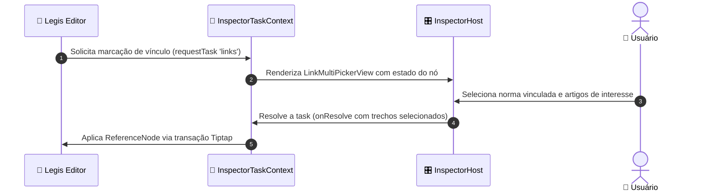

O módulo Legis adota a arquitetura de **Inspetor Lateral Unificado (Zero Dialogs)** para marcação e edição de situações especiais, vínculos entre normas e parametrização de metadados.

---

## 🏛️ Princípios de Design

1. **Zero Modais Bloqueantes**: Toda a edição de trechos, anotações jurídicas e vínculos acontece no painel lateral acoplado à direita, mantendo o editor sempre visível e navegável.
2. **Captura Direta de Seleção no Editor**: Ao selecionar um texto no editor Tiptap/Novel, o inspetor detecta automaticamente o trecho e oferece as ações de situação aplicáveis.
3. **Âncoras Canônicas de Trecho (`segment-anchor.ts`)**: Armazenamento resiliente de posições de palavras e redundância de contexto (`anchorBefore` / `anchorAfter`), prevenindo perda de anotações em edições posteriores.

---

## 📐 Modos e Larguras do Inspetor

O chassi do inspetor (`InspectorShell.tsx`) adapta sua largura conforme o contexto de trabalho:

| Modo | Largura | Finalidade |
| :--- | :--- | :--- |
| **Compact** | `264px` | Exibição de sumário e lista de nós. |
| **Default** | `360px` | Edição de propriedades de elemento e situações simples. |
| **Expanded** | `480px` | Seleção de trechos longos e vínculos com outras normas (`LinkPickerView`). |
| **Wide** | `520px` (cap `42vw`) | Editor de código HTML e comparador de redações. |
| **Collapsed** | `40px` | Rail lateral com ícones rápidos de alternância. |

---

## 🔗 Ciclo de Vida de Tarefas (`inspector-task-context.tsx`)

Componentes da coluna central comunicam-se com o painel lateral através de um barramento de tarefas assíncronas:

---

## 🛡️ Ancoragem e Resiliência a Deriva de Texto

A tecnologia `segment-anchor.ts` resolve trechos anotados mesmo após alterações no texto circundante:
- Snap automático por palavra inteira.
- Detecção de deriva textual via distância Levenshtein.
- Preservação dos IDs de elementos normativos (`attrs.normativeId`) durante sincronizações estruturais automáticas.
